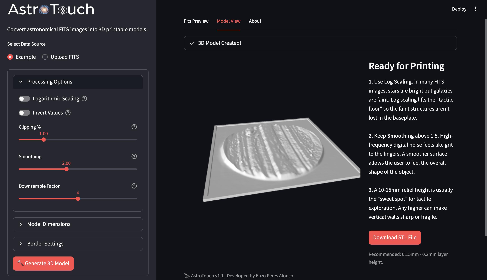

<p align="center">
  
</p>

<p align="center">
  <em>From Light to Touch: A tool to convert astronomical FITS images into 3D-printable tactile models.</em>
</p>

---

**AstroTouch** is an open-source web application designed to make astronomical data accessible to everyone, particularly the visually impaired community. It generates tactile relief maps from scientific FITS files that can be printed on any consumer-grade 3D printer.



## Key Features

- **FITS File Support**: Upload your own `.fits` or `.fz` files or use the built-in example.
- **Interactive 2D Preview**: Pan and zoom through the FITS data with adjustable scaling (linear or logarithmic) before generating a model.
- **Advanced 3D Controls**: Fine-tune the final model with intuitive sliders for:
    - **Geometry**: Adjust relief height, model width, and base thickness.
    - **Border**: Add a raised border to frame the model.
    - **Quality**: Control data clipping, smoothing, and downsampling for optimal results.
- **Real-time 3D Viewer**: Inspect the generated `.stl` model with an interactive 3D canvas right in your browser.
- **One-Click Download**: Instantly download the generated `.stl` file, ready for your 3D printer's slicer software.

## Getting Started

Follow these instructions to set up and run a local instance of AstroTouch.

### Prerequisites

- Python 3.8 or newer
- `pip` for package management

### Installation

1.  **Clone the repository:**
    ```bash
    git clone https://github.com/enzoperesafonso/AstroTouch.git
    cd AstroTouch
    ```

2.  **Create and activate a virtual environment:**
    - **macOS / Linux:**
      ```bash
      python3 -m venv .venv
      source .venv/bin/activate
      ```
    - **Windows:**
      ```bash
      python -m venv .venv
      .venv\Scripts\activate
      ```

3.  **Install the required dependencies:**
    ```bash
    pip install -r requirements.txt
    ```

### Running the Application

Once the dependencies are installed, you can launch the application with a single command:

```bash
streamlit run astrotouch.py
```

Your web browser should automatically open to the AstroTouch application.

## How to Use

1.  **Select Data Source**: Choose between the pre-loaded "Example" FITS file or "Upload FITS" to use your own data.
2.  **Preview Data**: In the "Fits Preview" tab, inspect the 2D data. Use the `Log Scale` and `Invert` toggles in the sidebar to see how the data transforms.
3.  **Adjust Parameters**: Use the sliders in the sidebar to define the geometry, border, and quality of your 3D model.
4.  **Generate Model**: Click the **"Generate 3D Model"** button. The application will process the data and switch to the "Model View" tab.
5.  **Inspect & Download**: Interact with the 3D model in the viewer. If you are satisfied, click the **"Download STL"** button to save the file.

## How It Works

AstroTouch processes scientific FITS data through a specific mathematical pipeline to create a tangible model:

1.  **Intensity Mapping**: Pixel brightness values from the FITS file are treated as physical height on the Z-axis. Higher intensity values become peaks, while darker areas become valleys.
2.  **Logarithmic Scaling**: Astronomical objects often have an extreme dynamic range. A logarithmic transform ($Z_{new} = \log(1+Z)$) is applied to ensure that faint, subtle structures become tactilely perceptible.
3.  **Mesh Generation**: The processed 2D array is converted into a 3D manifold. The tool connects thousands of triangles to form a watertight STL surface, which is the standard format for 3D printing.

## Acknowledgements & Support

This tool is built on the shoulders of giants. It relies heavily on the following open-source libraries:
- [Astropy](https://www.astropy.org/)
- [NumPy](https://numpy.org/) & [SciPy](https://scipy.org/)
- [Streamlit](https://streamlit.io/)
- [NumPy-STL](https://github.com/WoLpH/numpy-stl)
- [Streamlit-STL](https://github.com/Lucandia/streamlit_stl)

If you find this software useful, please consider supporting the cause of accessibility by donating to the **[South African Guide Dogs Association for the Blind](https://guidedog.org.za/donate/)**.

---
*Created by Enzo Peres Afonso*
